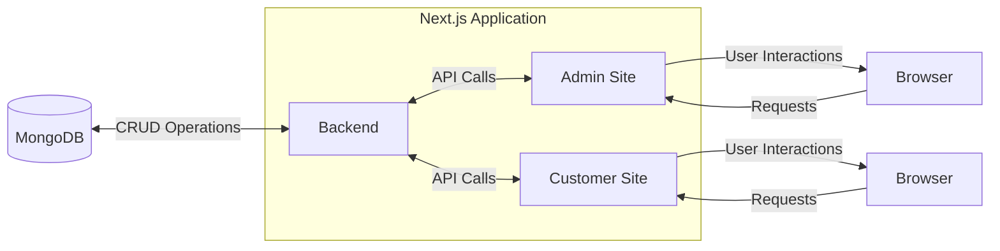

# Pyme
*Now deployed on:* https://pyme-rouge.vercel.app/

Pyme is a multi-store e-commerce store front designed to support small and local businesses. Designed and build with a team of 3 developers, Pyme (short for Pequeña y mediana empresa) was inspired by the Colombian heritage and small business ownership experience of Valentina Valverde, a developer on the team. Built with Next.js and Mongo DB, this full-stack application uses Typescript for its coding language, Clerk.js for login and Stripe for payment.

Pyme users can enjoy the experience as a small business owner hosting a storefront or as a customer purchasing quality products to support regional small businesses. Customers can enjoy a secure and quick login experience, and easy to navigate user experience and clean user interface to be able to find products quickly and checkout securely using Stripe for payment. 

*Learn more about the developers:*
- www.linkedin.com/in/valentina-valverde-1a179227a/
- www.linkedin.com/in/jeremiah-wise-cpa-78910368/
- www.linkedin.com/in/jlotten

## Getting Started

### Visit us on the web:
1. Visit the Website: Go to Pyme to explore the platform: https://pyme-rouge.vercel.app/
2. Sign Up: Create an account to get started.
3. Set Up Your Profile: Fill in your business details to tailor the platform to your needs and attract local customers.
4. Explore Features: Navigate through the various features to understand how Pyme can benefit your business.

## Store Owners

- Customize your store profile to appeal to your customer base: 


- Easily upload your products with descriptions and prices:


- Seemlessly track each order made:


## Customers

- Enjoy an easy browsing and purchasing experience with different local small businesses:


- Get to know the business and store owner through their customized profiles:


- Experience easy shopping of great local products that support your community and region:


### To run locally: 
First, run the development server:

```bash
npm run dev
# or
yarn dev
# or
pnpm dev
# or
bun dev
```

Open [http://localhost:3000](http://localhost:3000) with your browser to see the result.

## Architecture



## License

Pyme is released under the MIT License.

## Deploy on Vercel

Pyme is currently deployed on Vercel: https://pyme-rouge.vercel.app/

## References

- https://clerk.com/
- https://docs.stripe.com/development
- https://nextjs.org/
- https://github.com/basir/next-amazona-v2
- https://daisyui.com/
- https://mui.com/material-ui/
- https://vercel.com/docs/frameworks/nextjs


